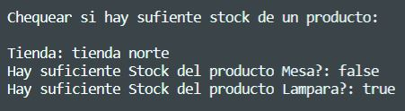

# DIP Exercise Kata Shops
This Project consist of trying to resolve DIP kata Exercise from "Panel De Actividad" from Programming Subject.
The code from this Exercise Kata belong to user @dfleta
https://github.com/dfleta

I only resolve the kata for understanding the use of
DIP (Dependency Inversion Principle)

<!--Logos-->

## Tabla de Contenidos

1. [Salida de la Aplicación](#salidas-de-la-aplicacion)
1. [Tecnologías Usadas](#tecnologias-usadas)
1. [Reflexiones](#reflexiones)
1. [Licencia](#licencia)

---

## Salida de mi Aplicación

**[⬆ back to top](#tabla-de-contenidos)**

---

## Tecnologías Usadas

- Java JDK 11
- Maven
- Visual Studio Code
- Git

**[⬆ back to top](#tabla-de-contenidos)**

---

## Reflexiones

### Que has mejorado con este proyecto?

With this Kata I could understand the importance of use
DIP principle to keep abstractions between up and low level modules, because in the future if we want extend our classes of one module to use it with other components of the project, we can do it without many problems because the modules don't dedend now of other modules but both depend on Abstractions.

**[⬆ back to top](#tabla-de-contenidos)**

---

## Licencia

MIT License

Copyright (c) 2021 Mateo Garcia Gonzalez

Permission is hereby granted, free of charge, to any person obtaining a copy
of this software and associated documentation files (the "Software"), to deal
in the Software without restriction, including without limitation the rights
to use, copy, modify, merge, publish, distribute, sublicense, and/or sell
copies of the Software, and to permit persons to whom the Software is
furnished to do so, subject to the following conditions:

The above copyright notice and this permission notice shall be included in all
copies or substantial portions of the Software.

**[⬆ back to top](#tabla-de-contenidos)**

---

## Autor
Mateo Garcia Gonzalez